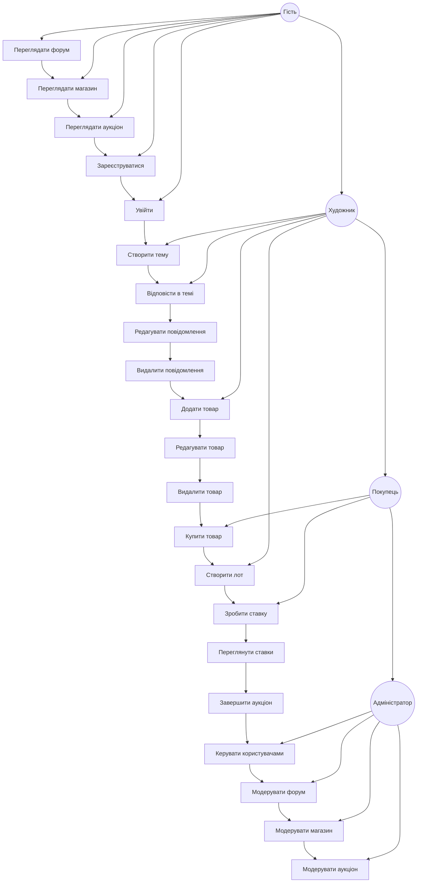
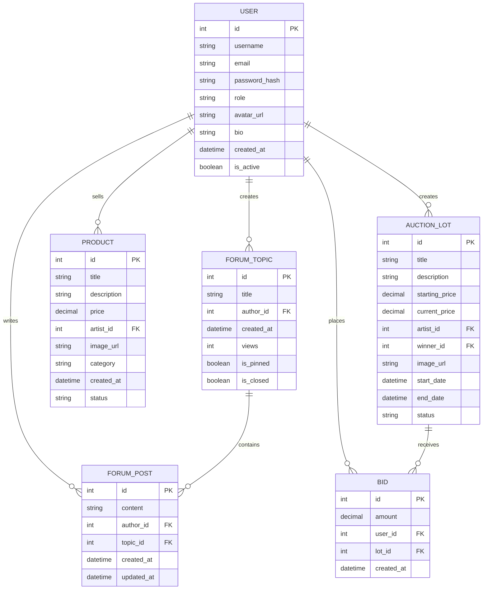
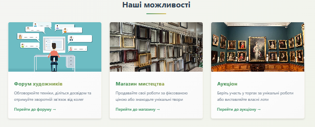
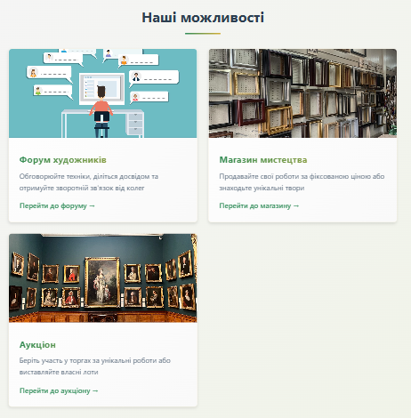
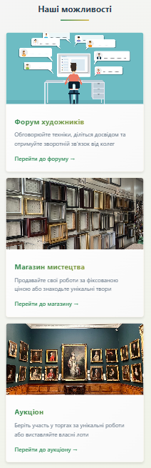
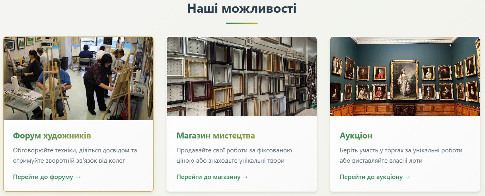

# 🎨 ArtHub - Платформа для художників


**Лабораторна робота №1** з дисципліни «WEB-орієнтовані технології. Backend розробки»  
**Тема:** ВИБІР ПРЕДМЕТНОЇ ОБЛАСТІ. АНАЛІЗ, МОДЕЛЮВАННЯ ТА РОЗРОБЛЕННЯ АДАПТИВНОГО WEB-ЗАСТОСУНКУ

---

## 📋 ЗМІСТ

- [ArtHub - Платформа для художників](#-arthub--платформа-для-художників-форум--магазин--аукціон)
  - [ЗМІСТ](#-зміст)
  - [АНАЛІЗ ТА МОДЕЛЮВАННЯ СИСТЕМИ](#аналіз-та-моделювання-системи)
    - [Актуальність теми](#актуальність-теми)
    - [Мета роботи](#мета-роботи)
    - [Завдання роботи](#завдання-роботи)
    - [Об'єкт роботи](#обєкт-роботи)
    - [Предмет роботи](#предмет-роботи)
    - [Бізнес-логіка](#бізнес-логіка)
  - [ФУНКЦІОНАЛЬНІ ТА НЕФУНКЦІОНАЛЬНІ ВИМОГИ](#функціональні-та-нефункціональні-вимоги)
    - [Функціональні вимоги (FR)](#функціональні-вимоги-fr)
    - [Нефункціональні вимоги (NFR)](#нефункціональні-вимоги-nfr)
  - [ДІАГРАМИ](#діаграми)
    - [Use-Case діаграма](#use-case-діаграма)
    - [ER-діаграма](#er-діаграма)
  - [ПРОЄКТУВАННЯ ІНТЕРФЕЙСУ](#проєктування-інтерфейсу)
    - [Структурні компоненти](#структурні-компоненти)
    - [Адаптивна сітка](#адаптивна-сітка)
    - [Бургер-меню](#бургер-меню)
    - [Анімації та ефекти](#анімації-та-ефекти)
  - [ФАЙЛОВА СТРУКТУРА ПРОЄКТУ](#файлова-структура-проєкту)
  - [РОБОТА З GIT ТА GITHUB](#робота-з-git-та-github)
    - [Структура гілок](#структура-гілок)
    - [Приклади комітів](#приклади-комітів)
  - [ТЕХНІЧНА РЕАЛІЗАЦІЯ](#технічна-реалізація)
    - [HTML-код (index.html)](#html-код-indexhtml)
    - [CSS-код (style.css)](#css-код-stylecss)
    - [JavaScript-код (main.js)](#javascript-код-mainjs)
  - [ТЕСТУВАННЯ АДАПТИВНОСТІ](#тестування-адаптивності)
  - [КОРИСНІ ПОСИЛАННЯ](#корисні-посилання)
  - [ВИСНОВКИ](#висновки)

---

##  АНАЛІЗ ТА МОДЕЛЮВАННЯ СИСТЕМИ

### Актуальність теми
У сучасному цифровому просторі художники змушені використовувати різні платформи для різних потреб:
- **Соціальні мережі** (Instagram, Pinterest) - для пошуку аудиторії та спілкування
- **Маркетплейси** (Etsy, Saatchi Art) - для продажу робіт
- **Спеціалізовані аукціони** - для продажу дорогих робіт

Це створює ряд проблем:
- Фрагментація аудиторії
- Необхідність підтримувати декілька профілів
- Складність просування власного бренду
- Відсутність єдиного простору для спілкування та комерції

**Вирішення проблеми:** створення єдиної платформи ArtHub, яка об'єднує:
- **Форум** - для спілкування, обміну досвідом, отримання зворотного зв'язку
- **Магазин** - для прямого продажу робіт за фіксованою ціною
- **Аукціон** - для продажу унікальних робіт через механізм торгів

### Мета роботи
Розробка адаптивного веб-застосунку для художників ArtHub, що об'єднує функціонал тематичного форуму, онлайн-магазину та аукціону мистецьких робіт із забезпеченням коректного відображення на всіх типах пристроїв.

### Завдання роботи
1. Провести аналіз предметної області та визначити потреби цільової аудиторії (художників, колекціонерів, покупців)
2. Сформулювати функціональні та нефункціональні вимоги до системи
3. Спроєктувати логічну структуру бази даних (ER-діаграма)
4. Розробити Use-case діаграму для визначення сценаріїв взаємодії користувачів
5. Створити адаптивний інтерфейс з використанням HTML5, CSS3 (Flexbox/Grid) та медіа-запитів
6. Реалізувати адаптивну навігацію з бургер-меню для мобільних пристроїв
7. Додати інтерактивні елементи та анімації для покращення UX
8. Організувати роботу з системою контролю версій Git та розмістити проєкт у відкритому репозиторії GitHub

### Об'єкт роботи
Процес створення адаптивного веб-застосунку для творчої спільноти.

### Предмет роботи
Методи, засоби та підходи до проєктування, моделювання та розроблення адаптивного веб-інтерфейсу з інтегрованими модулями (форум, магазин, аукціон).

### Бізнес-логіка

| Категорія | Правила |
|:----------|:--------|
| **Реєстрація та профілі** | • Користувач може зареєструватися як "Художник" (може продавати) або "Колекціонер/Покупець" (може купувати)<br>• Для публікації лоту на аукціоні художник повинен мати підтверджений email та заповнений профіль |
| **Форум** | • Нова тема на форумі створюється тільки зареєстрованим користувачем<br>• Користувач може редагувати своє повідомлення протягом 15 хвилин після публікації |
| **Магазин** | • Ціна на товар вказується обов'язково<br>• Якщо товар куплено, він автоматично зникає з вітрини |
| **Аукціон** | • Торги за лот тривають 7 днів<br>• Ставка може бути збільшена мінімум на 5% від попередньої ставки<br>• Аукціон автоматично завершується, якщо протягом 24 годин не було нових ставок |

---

## ФУНКЦІОНАЛЬНІ ТА НЕФУНКЦІОНАЛЬНІ ВИМОГИ

### Функціональні вимоги (FR)

| ID | Вимога | Опис |
|:---|:-------|:-----|
| **FR-1** | Реєстрація та авторизація | Система повинна дозволяти користувачу реєструватися та авторизуватися |
| **FR-2** | Управління форумом | Система повинна надавати можливість створювати, редагувати та видаляти теми/повідомлення на форумі |
| **FR-3** | Перегляд магазину | Система повинна відображати список товарів у магазині з фільтрацією за категоріями |
| **FR-4** | Додавання товарів | Система повинна дозволяти художнику додавати нові роботи до магазину (назва, опис, ціна, зображення) |
| **FR-5** | Участь в аукціоні | Система повинна дозволяти переглядати активні лоти аукціону та робити ставки |
| **FR-6** | Сповіщення | Система повинна повідомляти користувача про виграний лот |
| **FR-7** | Адаптивна навігація | Система повинна мати адаптивне меню, що трансформується в "бургер" на мобільних пристроях |

### Нефункціональні вимоги (NFR)

| ID | Вимога | Опис |
|:---|:-------|:-----|
| **NFR-1** | Адаптивність | Інтерфейс повинен коректно відображатися на пристроях з шириною екрана від 320px до 1920px |
| **NFR-2** | Продуктивність | Час завантаження головної сторінки не повинен перевищувати 3 секунди |
| **NFR-3** | Зручність | Інтерфейс має бути інтуїтивно зрозумілим, з використанням сучасних UX/UI патернів |
| **NFR-4** | Сумісність | Коректне відображення в останніх версіях браузерів Chrome, Firefox, Safari, Edge |
| **NFR-5** | Структура коду | Код проєкту має бути логічно структурований у відповідні папки (css, js, assets) |
| **NFR-6** | Семантична верстка | Використання семантичних тегів HTML5 для покращення SEO та доступності |

---

## ДІАГРАМИ

### Use-Case діаграма

*Рис. 1: Use-Case діаграма платформи ArtHub*



**Опис діаграми:**
На діаграмі відображено чотири актори:
- **Гість** (неавторизований відвідувач) - може переглядати форум, магазин та аукціон, а також зареєструватися або увійти
- **Художник** - має всі права гостя + може створювати теми на форумі, додавати роботи в магазин, виставляти лоти на аукціон
- **Покупець** - має всі права гостя + може купувати товари в магазині, робити ставки на аукціоні, коментувати на форумі
- **Адміністратор** - має права на модерування контенту та управління користувачами

### ER-діаграма

*Рис 2: ER-діаграма бази даних ArtHub*



**Сутності та атрибути:**

| Сутність | Атрибути |
|:---------|:---------|
| **Користувач** | id, ім'я, email, пароль, роль, аватар, дата реєстрації, біо |
| **Тема форуму** | id, заголовок, автор_id, дата створення, перегляди, статус |
| **Повідомлення** | id, текст, автор_id, тема_id, дата |
| **Товар (Магазин)** | id, назва, опис, ціна, зображення, художник_id, статус, категорія |
| **Лот (Аукціон)** | id, назва, опис, стартова_ціна, поточна_ціна, переможець_id, дата_завершення, зображення |
| **Ставка** | id, сума, користувач_id, лот_id, дата |

**Зв'язки:**
- Користувач (1) → (M) Тема форуму
- Користувач (1) → (M) Повідомлення
- Користувач (1) → (M) Товар
- Користувач (1) → (M) Лот
- Користувач (1) → (M) Ставка
- Тема форуму (1) → (M) Повідомлення
- Лот (1) → (M) Ставка

---

## ПРОЄКТУВАННЯ ІНТЕРФЕЙСУ

### Структурні компоненти

*Рис 3: Схема структури інтерфейсу (header, main, footer)*

```mermaid
graph TD
    subgraph Header["Header (Шапка сайту)"]
        H1["Логотип - ArtHub"]
        H2["Навігаційне меню"]
        H3["Кнопки автентифікації"]
        
        subgraph NavDesktop["Навігаційне меню (десктоп)"]
            N1["Форум"]
            N2["Магазин"]
            N3["Аукціон"]
            N4["Про нас"]
        end
        
        subgraph BurgerMenu["Бургер-меню (мобільне)"]
            B1["Іконка бургера"]
            B2["Вертикальне меню"]
        end
        
        subgraph AuthButtons["Кнопки автентифікації"]
            A1["Увійти"]
            A2["Реєстрація"]
        end
    end
    
    subgraph Main["Main (Основний контент)"]
        M1["Hero-секція"]
        M2["Сітка карток"]
        M3["CTA-секція"]
        
        subgraph Hero["Hero-секція"]
            HERO1["Заголовок: Творча спільнота для художників"]
            HERO2["Підзаголовок"]
            HERO3["Кнопка: Приєднатися"]
        end
        
        subgraph GridDesktop["Сітка карток - 3 колонки (десктоп)"]
            C1["Картка форуму"]
            C2["Картка магазину"]
            C3["Картка аукціону"]
            
            subgraph CardForum["Картка форуму"]
                C1_IMG["Зображення"]
                C1_TITLE["Заголовок: Форум"]
                C1_DESC["Опис"]
                C1_BTN["Кнопка: Перейти"]
            end
            
            subgraph CardShop["Картка магазину"]
                C2_IMG["Зображення"]
                C2_TITLE["Заголовок: Магазин"]
                C2_DESC["Опис"]
                C2_BTN["Кнопка: Перейти"]
            end
            
            subgraph CardAuction["Картка аукціону"]
                C3_IMG["Зображення"]
                C3_TITLE["Заголовок: Аукціон"]
                C3_DESC["Опис"]
                C3_BTN["Кнопка: Перейти"]
            end
        end
        
        subgraph GridTablet["Сітка карток - 2 колонки (планшет)"]
            C_TAB["Картки розташовані в 2 колонки"]
        end
        
        subgraph GridMobile["Сітка карток - 1 колонка (смартфон)"]
            C_MOB["Картки розташовані вертикально"]
        end
        
        subgraph CTA["CTA-секція"]
            CTA1["Заголовок: Готові долучитися?"]
            CTA2["Текст"]
            CTA3["Кнопка: Створити акаунт"]
        end
    end
    
    subgraph Footer["Footer (Підвал)"]
        F1["Колонка 1: Про нас"]
        F2["Колонка 2: Навігація"]
        F3["Колонка 3: Контакти"]
        F4["Колонка 4: Соцмережі"]
        F5["Нижній колонтитул"]
        
        subgraph Col1["Колонка 1: Про нас"]
            F1_TITLE["Заголовок: ArtHub"]
            F1_TEXT["Опис платформи"]
        end
        
        subgraph Col2["Колонка 2: Навігація"]
            F2_LINKS["Посилання: Форум, Магазин, Аукціон"]
        end
        
        subgraph Col3["Колонка 3: Контакти"]
            F3_EMAIL["Email: info@arthub.com"]
            F3_PHONE["Телефон"]
        end
        
        subgraph Col4["Колонка 4: Соцмережі"]
            F4_ICONS["Іконки Facebook, Instagram, Twitter"]
        end
        
        subgraph Bottom["Нижній колонтитул"]
            F5_COPY["Копірайт"]
            F5_LINKS["Політика, Умови"]
        end
    end
    
    %% Зв'язки
    H2 --> N1
    H2 --> N2
    H2 --> N3
    H2 --> N4
    H2 -.-> B1
    B1 --> B2
    
    H3 --> A1
    H3 --> A2
    
    M1 --> HERO1
    M1 --> HERO2
    M1 --> HERO3
    
    M2 --> C1
    M2 --> C2
    M2 --> C3
    
    C1 --> C1_IMG
    C1 --> C1_TITLE
    C1 --> C1_DESC
    C1 --> C1_BTN
    
    C2 --> C2_IMG
    C2 --> C2_TITLE
    C2 --> C2_DESC
    C2 --> C2_BTN
    
    C3 --> C3_IMG
    C3 --> C3_TITLE
    C3 --> C3_DESC
    C3 --> C3_BTN
    
    M3 --> CTA1
    M3 --> CTA2
    M3 --> CTA3
    
    F1 --> F1_TITLE
    F1 --> F1_TEXT
    
    F2 --> F2_LINKS
    
    F3 --> F3_EMAIL
    F3 --> F3_PHONE
    
    F4 --> F4_ICONS
    
    F5 --> F5_COPY
    F5 --> F5_LINKS
```



**Header (шапка сайту):**
- Логотип (ліворуч)
- Навігаційне меню (по центру) - пункти: "Форум", "Магазин", "Аукціон", "Про нас"
- Кнопки авторизації (праворуч) - "Увійти" / "Реєстрація"

**Main (основний контент):**
- Hero-секція з коротким описом платформи
- Сітка карток з трьома блоками:
  - "Останнє на форумі" (останні теми)
  - "Популярне в магазині" (популярні роботи)
  - "Гарячі лоти аукціону" (активні лоти)
- Call-to-action секція для реєстрації

**Footer (підвал):**
- Контактна інформація
- Посилання на соціальні мережі
- Карта сайту
- Політика конфіденційності та умови використання

### Адаптивна сітка

*Рис 4: Адаптивна сітка на десктопі (3 колонки)*


*Рис 5: Адаптивна сітка на планшеті (2 колонки)*


*Рис 6: Адаптивна сітка на смартфоні (1 колонка)*


Для реалізації адаптивної сітки використовується CSS Grid з медіа-запитами:

```css
.card-grid {
    display: grid;
    grid-template-columns: repeat(3, 1fr); /* 3 колонки на десктопі */
    gap: 24px;
    margin: 40px 0;
}

/* Планшет (від 481px до 768px) */
@media (max-width: 768px) {
    .card-grid {
        grid-template-columns: repeat(2, 1fr); /* 2 колонки */
        gap: 20px;
    }
}

/* Смартфон (до 480px) */
@media (max-width: 480px) {
    .card-grid {
        grid-template-columns: 1fr; /* 1 колонка */
        gap: 16px;
    }
}
```

### Анімації та ефекти

*Рис 9: Hover-ефекти на картках*


**Hover-ефекти для карток:**
```css
.card {
    transition: all 0.3s ease;
    border-radius: 8px;
    overflow: hidden;
    box-shadow: 0 4px 6px rgba(0,0,0,0.1);
}

.card:hover {
    transform: translateY(-10px);
    box-shadow: var(--shadow-gold);
    border-color: var(--secondary-color);
}

.card img {
    width: 100%;
    height: 200px;
    object-fit: cover;
    transition: transform 0.5s ease;
}

.card:hover img {
    transform: scale(1.05);
}
```

**Анімація появи контенту:**
```css
@keyframes fadeInUp {
    from {
        opacity: 0;
        transform: translateY(30px);
    }
    to {
        opacity: 1;
        transform: translateY(0);
    }
}

.card {
    animation: fadeInUp 0.6s ease forwards;
}

/* Затримка для кожної картки */
.card:nth-child(1) { animation-delay: 0.1s; }
.card:nth-child(2) { animation-delay: 0.2s; }
.card:nth-child(3) { animation-delay: 0.3s; }
```

---

## ФАЙЛОВА СТРУКТУРА ПРОЄКТУ

*Рис 11: Структура папок у провіднику*

```
artist-platform/
│
├── index.html                   # Головна сторінка
├── README.md                    # Документація проєкту
│
├── /css/
│   └── style.css                # Всі стилі проєкту
│
├── /js/
│   └── main.js                  # JavaScript для бургер-меню та анімацій
│
├── /assets/
│   ├── /images/                 # Зображення для контенту
│   │   ├── auction.webp
│   │   ├── forum.jpg
│   │   ├── shop.jpg
│   │   └── ...
│   │
│   └── /icons/                   # Іконки та логотипи
│       ├── facebook.png
│       ├── instagram.png
        ├── pinterest.png
        ├── twitter.png
│       └── ...
```

---

## РОБОТА З GIT ТА GITHUB

### Структура гілок

*Рис 12: Граф гілок у GitGraph*

```
main
│
├── develop
│   │
│   ├── feature/header
│   ├── feature/grid
│   ├── feature/burger-menu
│   ├── feature/footer
│   └── feature/animations
│
└── hotfix/fix-navigation
```

**Опис гілок:**
- `main` - стабільна версія проєкту
- `develop` - гілка для розробки
- `feature/header` - розробка шапки сайту
- `feature/grid` - реалізація адаптивної сітки
- `feature/burger-menu` - створення бургер-меню
- `feature/footer` - розробка підвалу
- `feature/animations` - додавання анімацій
- `hotfix/fix-navigation` - виправлення помилок навігації

---

## ТЕХНІЧНА РЕАЛІЗАЦІЯ

### HTML-код (index.html)

```html
<!DOCTYPE html>
<html lang="uk">
<head>
    <meta charset="UTF-8">
    <meta name="viewport" content="width=device-width, initial-scale=1.0">
    <title>ArtHub - Платформа для художників</title>
    <link rel="stylesheet" href="css/style.css">
</head>
<body>
    <header>
        <nav class="navbar container">
            <div class="logo">
                
                <span>ArtHub</span>
            </div>
            
            <div class="menu-toggle" id="mobile-menu">
                <span class="bar"></span>
                <span class="bar"></span>
                <span class="bar"></span>
            </div>
            
            <ul class="nav-menu" id="nav-menu">
                <li><a href="#" class="active">Головна</a></li>
                <li><a href="#">Форум</a></li>
                <li><a href="#">Магазин</a></li>
                <li><a href="#">Аукціон</a></li>
                <li><a href="#">Про нас</a></li>
                <li class="auth-buttons">
                    <a href="#" class="btn-login">Увійти</a>
                    <a href="#" class="btn-register">Реєстрація</a>
                </li>
            </ul>
        </nav>
    </header>

    <main>
        <section class="hero">
            <div class="container">
                <h1>Творча спільнота для справжніх художників</h1>
                <p>Спілкуйся, продавай та купуй мистецтво в одному місці</p>
                <a href="#" class="btn-primary">Приєднатися</a>
            </div>
        </section>

        <section class="features">
            <div class="container">
                <h2>Наші можливості</h2>
                <div class="card-grid">
                    <div class="card">
                        
                        <h3>Форум художників</h3>
                        <p>Обговорюйте техніки, діліться досвідом та отримуйте зворотній зв'язок від колег</p>
                        <a href="#" class="btn-secondary">Перейти до форуму →</a>
                    </div>
                    
                    <div class="card">
                        
                        <h3>Магазин мистецтва</h3>
                        <p>Продавайте свої роботи за фіксованою ціною або знаходьте унікальні твори</p>
                        <a href="#" class="btn-secondary">Перейти до магазину →</a>
                    </div>
                    
                    <div class="card">
                        
                        <h3>Аукціон</h3>
                        <p>Беріть участь у торгах за унікальні роботи або виставляйте власні лоти</p>
                        <a href="#" class="btn-secondary">Перейти до аукціону →</a>
                    </div>
                </div>
            </div>
        </section>

        <section class="cta">
            <div class="container">
                <h2>Готові долучитися до спільноти?</h2>
                <p>Зареєструйтесь зараз та отримайте можливість продавати свої роботи без комісії перші 3 місяці</p>
                <a href="#" class="btn-primary btn-large">Створити акаунт</a>
            </div>
        </section>
    </main>

    <footer>
        <div class="container">
            <div class="footer-content">
                <div class="footer-section">
                    <h4>ArtHub</h4>
                    <p>Платформа для художників, що об'єднує форум, магазин та аукціон в одному місці.</p>
                </div>
                
                <div class="footer-section">
                    <h4>Навігація</h4>
                    <ul>
                        <li><a href="#">Головна</a></li>
                        <li><a href="#">Форум</a></li>
                        <li><a href="#">Магазин</a></li>
                        <li><a href="#">Аукціон</a></li>
                        <li><a href="#">Про нас</a></li>
                    </ul>
                </div>
                
                <div class="footer-section">
                    <h4>Контакти</h4>
                    <p>Email: info@arthub.com</p>
                    <p>Телефон: +380 (44) 123-45-67</p>
                </div>
                
                <div class="footer-section">
                    <h4>Соціальні мережі</h4>
                    <div class="social-links">
                        <a href="#"></a>
                        <a href="#"></a>
                        <a href="#"></a>
                        <a href="#"></a>
                    </div>
                </div>
            </div>
            
            <div class="footer-bottom">
                <p>&copy; 2025 ArtHub. Всі права захищені.</p>
                <div class="footer-links">
                    <a href="#">Політика конфіденційності</a>
                    <a href="#">Умови використання</a>
                </div>
            </div>
        </div>
    </footer>

    <script src="js/main.js"></script>
</body>
</html>
```

### CSS-код (style.css)

```css
/* ===== ЗМІННІ ТА СКИДАННЯ ===== */
:root {
    --primary-color: #4a6fa5;
    --secondary-color: #6b4e71;
    --accent-color: #c0a080;
    --text-dark: #333333;
    --text-light: #666666;
    --bg-light: #f8f9fa;
    --white: #ffffff;
    --shadow: 0 4px 6px rgba(0, 0, 0, 0.1);
    --shadow-hover: 0 10px 20px rgba(0, 0, 0, 0.15);
    --transition: all 0.3s ease;
}

* {
    margin: 0;
    padding: 0;
    box-sizing: border-box;
}

body {
    font-family: 'Segoe UI', Tahoma, Geneva, Verdana, sans-serif;
    line-height: 1.6;
    color: var(--text-dark);
}

.container {
    width: 90%;
    max-width: 1200px;
    margin: 0 auto;
}

/* ===== HEADER ===== */
header {
    background-color: var(--white);
    box-shadow: var(--shadow);
    position: sticky;
    top: 0;
    z-index: 1000;
}

.navbar {
    display: flex;
    justify-content: space-between;
    align-items: center;
    padding: 1rem 0;
}

.logo {
    display: flex;
    align-items: center;
    gap: 0.5rem;
    font-size: 1.5rem;
    font-weight: bold;
    color: var(--primary-color);
}

.logo img {
    width: 32px;
    height: 32px;
}

.nav-menu {
    display: flex;
    list-style: none;
    gap: 2rem;
    align-items: center;
}

.nav-menu a {
    text-decoration: none;
    color: var(--text-dark);
    font-weight: 500;
    transition: var(--transition);
}

.nav-menu a:hover,
.nav-menu a.active {
    color: var(--primary-color);
}

.auth-buttons {
    display: flex;
    gap: 1rem;
}

.btn-login,
.btn-register {
    padding: 0.5rem 1rem;
    border-radius: 4px;
}

.btn-login {
    border: 1px solid var(--primary-color);
}

.btn-register {
    background-color: var(--primary-color);
    color: var(--white) !important;
}

/* ===== БУРГЕР-МЕНЮ ===== */
.menu-toggle {
    display: none;
    flex-direction: column;
    cursor: pointer;
}

.bar {
    width: 25px;
    height: 3px;
    background-color: var(--text-dark);
    margin: 3px 0;
    transition: var(--transition);
}

/* ===== HERO СЕКЦІЯ ===== */
.hero {
    background: linear-gradient(135deg, var(--primary-color), var(--secondary-color));
    color: var(--white);
    padding: 5rem 0;
    text-align: center;
}

.hero h1 {
    font-size: 2.5rem;
    margin-bottom: 1rem;
}

.hero p {
    font-size: 1.2rem;
    margin-bottom: 2rem;
    opacity: 0.9;
}

.btn-primary {
    display: inline-block;
    padding: 0.75rem 1.5rem;
    background-color: var(--white);
    color: var(--primary-color);
    text-decoration: none;
    border-radius: 4px;
    font-weight: 600;
    transition: var(--transition);
}

.btn-primary:hover {
    transform: translateY(-2px);
    box-shadow: var(--shadow-hover);
}

/* ===== СІТКА КАРТОК ===== */
.features {
    padding: 4rem 0;
    background-color: var(--bg-light);
}

.features h2 {
    text-align: center;
    margin-bottom: 2rem;
    font-size: 2rem;
}

.card-grid {
    display: grid;
    grid-template-columns: repeat(3, 1fr);
    gap: 2rem;
}

.card {
    background-color: var(--white);
    border-radius: 8px;
    overflow: hidden;
    box-shadow: var(--shadow);
    transition: var(--transition);
    animation: fadeInUp 0.6s ease forwards;
    opacity: 0;
}

.card:nth-child(1) { animation-delay: 0.1s; }
.card:nth-child(2) { animation-delay: 0.2s; }
.card:nth-child(3) { animation-delay: 0.3s; }

@keyframes fadeInUp {
    from {
        opacity: 0;
        transform: translateY(30px);
    }
    to {
        opacity: 1;
        transform: translateY(0);
    }
}

.card:hover {
    transform: translateY(-10px);
    box-shadow: var(--shadow-hover);
}

.card img {
    width: 100%;
    height: 200px;
    object-fit: cover;
    transition: transform 0.5s ease;
}

.card:hover img {
    transform: scale(1.05);
}

.card h3 {
    padding: 1rem 1rem 0.5rem;
    font-size: 1.3rem;
}

.card p {
    padding: 0 1rem 1rem;
    color: var(--text-light);
}

.btn-secondary {
    display: inline-block;
    margin: 0 1rem 1rem;
    color: var(--primary-color);
    text-decoration: none;
    font-weight: 600;
    transition: var(--transition);
}

.btn-secondary:hover {
    color: var(--secondary-color);
    transform: translateX(5px);
}

/* ===== CTA СЕКЦІЯ ===== */
.cta {
    padding: 4rem 0;
    text-align: center;
    background-color: var(--white);
}

.cta h2 {
    font-size: 2rem;
    margin-bottom: 1rem;
}

.cta p {
    max-width: 600px;
    margin: 0 auto 2rem;
    color: var(--text-light);
}

.btn-large {
    padding: 1rem 2rem;
    font-size: 1.1rem;
}

/* ===== FOOTER ===== */
footer {
    background-color: var(--text-dark);
    color: var(--white);
    padding: 3rem 0 1rem;
}

.footer-content {
    display: grid;
    grid-template-columns: repeat(4, 1fr);
    gap: 2rem;
    margin-bottom: 2rem;
}

.footer-section h4 {
    margin-bottom: 1rem;
    font-size: 1.2rem;
}

.footer-section ul {
    list-style: none;
}

.footer-section ul li {
    margin-bottom: 0.5rem;
}

.footer-section a {
    color: #ccc;
    text-decoration: none;
    transition: var(--transition);
}

.footer-section a:hover {
    color: var(--white);
}

.social-links {
    display: flex;
    gap: 1rem;
}

.social-links img {
    width: 24px;
    height: 24px;
    filter: brightness(0) invert(1);
    transition: var(--transition);
}

.social-links a:hover img {
    transform: scale(1.2);
}

.footer-bottom {
    text-align: center;
    padding-top: 2rem;
    border-top: 1px solid #555;
    font-size: 0.9rem;
    color: #ccc;
}

.footer-links {
    margin-top: 1rem;
}

.footer-links a {
    color: #ccc;
    text-decoration: none;
    margin: 0 1rem;
}

.footer-links a:hover {
    color: var(--white);
}

/* ===== АДАПТИВНІСТЬ ===== */
/* Планшет (від 481px до 768px) */
@media (max-width: 768px) {
    .menu-toggle {
        display: flex;
    }
    
    .nav-menu {
        display: none;
        flex-direction: column;
        width: 100%;
        position: absolute;
        top: 70px;
        left: 0;
        background-color: var(--white);
        padding: 2rem;
        box-shadow: 0 4px 6px rgba(0,0,0,0.1);
    }
    
    .nav-menu.active {
        display: flex;
    }
    
    .auth-buttons {
        flex-direction: column;
        width: 100%;
    }
    
    .btn-login,
    .btn-register {
        text-align: center;
    }
    
    .card-grid {
        grid-template-columns: repeat(2, 1fr);
        gap: 1.5rem;
    }
    
    .footer-content {
        grid-template-columns: repeat(2, 1fr);
    }
    
    .hero h1 {
        font-size: 2rem;
    }
}

/* Смартфон (до 480px) */
@media (max-width: 480px) {
    .card-grid {
        grid-template-columns: 1fr;
        gap: 1rem;
    }
    
    .footer-content {
        grid-template-columns: 1fr;
    }
    
    .hero h1 {
        font-size: 1.5rem;
    }
    
    .hero p {
        font-size: 1rem;
    }
    
    .features h2 {
        font-size: 1.5rem;
    }
    
    .cta h2 {
        font-size: 1.5rem;
    }
    
    .footer-links {
        display: flex;
        flex-direction: column;
        gap: 0.5rem;
    }
}

/* Анімація бургер-іконки */
.bar.active:nth-child(1) {
    transform: rotate(-45deg) translate(-5px, 6px);
}

.bar.active:nth-child(2) {
    opacity: 0;
}

.bar.active:nth-child(3) {
    transform: rotate(45deg) translate(-5px, -6px);
}
```

### JavaScript-код (main.js)

```javascript
// Бургер-меню
const mobileMenu = document.getElementById('mobile-menu');
const navMenu = document.getElementById('nav-menu');
const bars = document.querySelectorAll('.bar');

if (mobileMenu) {
    mobileMenu.addEventListener('click', () => {
        navMenu.classList.toggle('active');
        
        // Анімація бургер-іконки (перетворення на хрестик)
        bars.forEach(bar => bar.classList.toggle('active'));
    });
}

// Закриття меню при кліку на посилання (для зручності на мобільних)
const navLinks = document.querySelectorAll('.nav-menu a');
navLinks.forEach(link => {
    link.addEventListener('click', () => {
        navMenu.classList.remove('active');
        bars.forEach(bar => bar.classList.remove('active'));
    });
});

// Плавна поява елементів при прокручуванні
const observerOptions = {
    threshold: 0.1,
    rootMargin: '0px 0px -50px 0px'
};

const observer = new IntersectionObserver((entries) => {
    entries.forEach(entry => {
        if (entry.isIntersecting) {
            entry.target.style.animation = 'fadeInUp 0.6s ease forwards';
            observer.unobserve(entry.target);
        }
    });
}, observerOptions);

// Додаємо спостереження за картками, які ще не з'явилися
document.querySelectorAll('.card').forEach(card => {
    card.style.opacity = '0';
    observer.observe(card);
});

// Додаємо клас active для поточного пункту меню
const currentLocation = window.location.pathname;
navLinks.forEach(link => {
    if (link.getAttribute('href') === currentLocation) {
        link.classList.add('active');
    }
});
```

---

## ТЕСТУВАННЯ АДАПТИВНОСТІ

### Десктоп (1920x1080)

*Рис 13: Головна сторінка на десктопі*


**Характеристики:**
- 3-колонкова сітка карток
- Горизонтальне меню
- Максимальна ширина контейнера 1200px
- Великі зображення та шрифти

### Планшет (768x1024)

*Рис 14: Головна сторінка на планшеті (вертикальна орієнтація)*

*Рис 15: Головна сторінка на планшеті (горизонтальна орієнтація)*


**Характеристики:**
- 2-колонкова сітка карток
- Горизонтальне меню (якщо поміщається) або бургер-меню
- Зменшені відступи
- Медіа-запити для обох орієнтацій

### Смартфон (375x667)

*Рис 16: Головна сторінка на смартфоні (бургер-меню закрите)*

*Рис 17: Головна сторінка на смартфоні (бургер-меню відкрите)*


**Характеристики:**
- 1-колонкова сітка карток
- Бургер-меню
- Вертикальне розташування всіх елементів
- Адаптивні шрифти (використання rem та vw)

---

## КОРИСНІ ПОСИЛАННЯ

### Документація та стандарти
| Ресурс | Опис |
|:-------|:-----|
| [Conventional Commits](https://www.conventionalcommits.org/en/v1.0.0/) | Стандарт оформлення комітів |
| [W3Schools HTML](https://w3schoolsua.github.io/html/index.html) | Довідник з HTML |
| [W3Schools CSS](https://w3schoolsua.github.io/css/index.html) | Довідник з CSS |
| [CSS-TRICKS](https://css-tricks.com/) | Гайди та статті з CSS |
| [MDN Web Docs](https://developer.mozilla.org/) | Повна документація з веб-технологій |

### CSS Flexbox та Grid
| Ресурс | Опис |
|:-------|:-----|
| [CSS Grid Guide](https://css-tricks.com/snippets/css/complete-guide-grid/) | Повний гайд по CSS Grid |
| [CSS Flexbox Guide](https://css-tricks.com/snippets/css/a-guide-to-flexbox/) | Повний гайд по Flexbox |
| [Grid by Example](https://gridbyexample.com/) | Приклади використання Grid |
| [Flexbox Froggy](https://flexboxfroggy.com/) | Інтерактивна гра для вивчення Flexbox |

### Адаптивний дизайн
| Ресурс | Опис |
|:-------|:-----|
| [Media Queries](https://css-tricks.com/a-complete-guide-to-css-media-queries/) | Повний гайд по медіа-запитах |
| [Responsive Design Patterns](https://bradfrost.github.io/this-is-responsive/patterns.html) | Патерни адаптивного дизайну |
| [Viewport Sizes](https://viewportsizes.com/) | Розміри екранів популярних пристроїв |

### Інструменти для тестування
| Ресурс | Опис |
|:-------|:-----|
| [Google Chrome DevTools](https://developer.chrome.com/docs/devtools/) | Інструменти розробника Chrome |
| [Responsive Viewer](https://chrome.google.com/webstore/detail/responsive-viewer/inmopeiepgfljkpkidclfgbgbmfcennb) | Розширення для тестування адаптивності |
| [Am I Responsive](http://ami.responsivedesign.is/) | Перевірка адаптивності сайту |

### Іконки та зображення
| Ресурс | Опис |
|:-------|:-----|
| [Font Awesome](https://fontawesome.com/) | Бібліотека іконок |
| [Unsplash](https://unsplash.com/) | Безкоштовні стокові зображення |
| [Pexels](https://www.pexels.com/) | Безкоштовні фото та відео |
| [SVG Repo](https://www.svgrepo.com/) | Безкоштовні SVG іконки |

### Генератори коду
| Ресурс | Опис |
|:-------|:-----|
| [CSS Gradient](https://cssgradient.io/) | Генератор градієнтів |
| [Neumorphism.io](https://neumorphism.io/) | Генератор неоморфних стилів |
| [CSS Grid Generator](https://cssgrid-generator.netlify.app/) | Генератор CSS Grid |
| [Fancy Border Radius](https://9elements.github.io/fancy-border-radius/) | Генератор складних рамок |

---

## ВИСНОВКИ

У ході виконання лабораторної роботи №1 було:

1. **Проаналізовано предметну область** - виявлено потребу в єдиній платформі для художників, яка об'єднує спілкування (форум), комерцію (магазин) та унікальні продажі (аукціон).

2. **Сформульовано ключові характеристики системи**:
   - Актуальність - об'єднання розрізнених функцій в одному місці
   - Мета - створення адаптивного веб-застосунку для творчої спільноти
   - Завдання - деталізовано 8 конкретних кроків реалізації

3. **Спроєктовано логіку роботи**:
   - Бізнес-логіка - визначено правила для кожного модуля (форум, магазин, аукціон)
   - Функціональні вимоги - 7 ключових функцій системи
   - Нефункціональні вимоги - 6 вимог до якості та продуктивності

4. **Розроблено моделі**:
   - Use-case діаграма з 4 акторами та основними сценаріями використання
   - ER-діаграма з 6 сутностями та їх взаємозв'язками

5. **Реалізовано адаптивний інтерфейс** з використанням:
   - Семантичної верстки HTML5 (header, main, footer, section, article)
   - CSS Grid для побудови адаптивної сітки
   - Медіа-запитів для трьох типів пристроїв (десктоп, планшет, смартфон)
   - Flexbox для навігації та вирівнювання елементів
   - Відносних одиниць (%, rem, vw) для масштабованості

6. **Додано інтерактивні елементи**:
   - Бургер-меню з плавною анімацією для мобільних пристроїв
   - Hover-ефекти для карток та кнопок
   - Анімація появи контенту при завантаженні
   - Плавні переходи для всіх інтерактивних елементів

7. **Організовано роботу з Git**:
   - Створено структуру гілок (main, develop, feature/*)
   - Виконано логічно обґрунтовані коміти згідно з конвенціями
   - Підготовлено README.md з повною документацією

8. **Протестовано адаптивність** на різних пристроях:
   - Десктоп (1920x1080) - 3 колонки, горизонтальне меню
   - Планшет (768x1024) - 2 колонки, адаптивне меню
   - Смартфон (375x667) - 1 колонка, бургер-меню

**Отримані навички:**
- Проєктування інформаційних систем
- Робота з вимогами (функціональними та нефункціональними)
- Створення UML-діаграм (Use-case, ER)
- Семантична верстка HTML5
- Адаптивний веб-дизайн з використанням медіа-запитів
- CSS Grid та Flexbox для побудови складних макетів
- Створення інтерактивних елементів з анімацією
- Робота з системою контролю версій Git
- Оформлення технічної документації

**Напрями подальшого вдосконалення:**
1. Додати бекенд-частину для реальної роботи форуму, магазину та аукціону
2. Реалізувати систему автентифікації користувачів
3. Додати базу даних для зберігання інформації
4. Розширити функціонал згідно з бізнес-логікою
5. Оптимізувати продуктивність та SEO
6. Додати темну тему інтерфейсу
7. Реалізувати систему сповіщень

---

## 📌 Посилання на проєкт

- **Репозиторій:** [https://github.com/fwrwxx/art-forum.git](https://github.com/your-username/art-forum-shop-auction)
- **Жива сторінка:** [//](//)
- **Звітний HTML-документ:** [//](//)

---

*© Штифлюк Ольга Володимирівна 2026*
